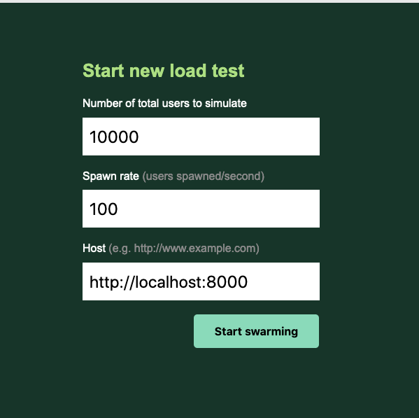
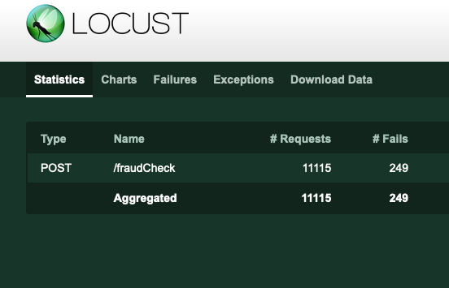
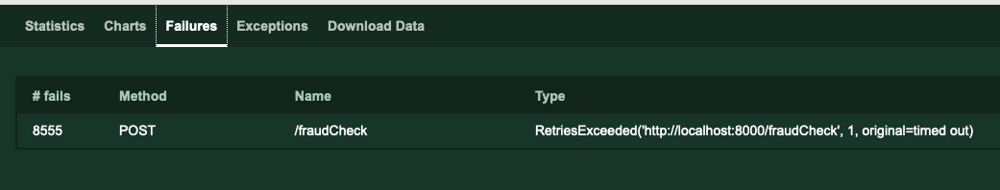
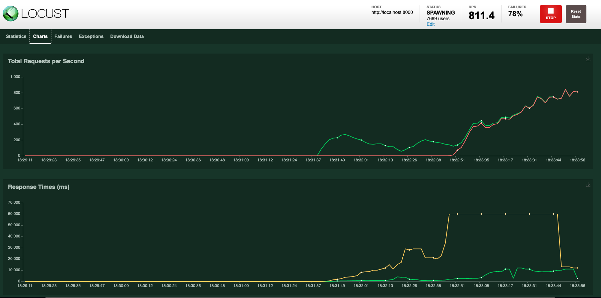

# Testy wydajnościowe

## Microbenchmarking

Zajrzyj do `tests/microbenchmarking_tests.py`. Opieramy się na bibliotece pytest-benchmarking, która produkuje nam ładnie wyglądające raporty:
```
--------------------------------------------------- benchmark: 1 tests ---------------------------------------------------
Name (time in us)             Min       Max     Mean   StdDev   Median     IQR  Outliers  OPS (Kops/s)  Rounds  Iterations
--------------------------------------------------------------------------------------------------------------------------
test_processing_fraud     33.5860  410.7760  39.2674  17.9517  36.1160  2.8505    47;136       25.4664    1317           1
--------------------------------------------------------------------------------------------------------------------------

Legend:
  Outliers: 1 Standard Deviation from Mean; 1.5 IQR (InterQuartile Range) from 1st Quartile and 3rd Quartile.
  OPS: Operations Per Second, computed as 1 / Mean
```

## Testy z wykorzystaniem Locusta

Chcemy przeprowadzić load testy, czyli zobaczyć ilu użytkowników jesteśmy w stanie obsłużyć. Oczywiście na potrzeby szkolenia nie przygotowujemy specjalnego środowiska, uruchamiamy po prostu aplikację lokalnie.

Przechodzimy do tego katalogu (`cd 05-architecture/05-05-performance/`)

Budujemy i startujemy aplikację używając docker-compose (`docker-compose up`)

Uruchamiamy locusta korzystając z komendy `locust`. Zaczyta ona nasz locustfile.py i uruchomi swój serwer na porcie 8089.

```
class FraudUser(FastHttpUser):
    wait_time = between(1, 2)
    connection_timeout = 1  # timeout 1 sekunda na połączenie

    @task
    def perform_fraud_check(self):
        ...
```
Przechodzimy do interfejsu locusta `http://127.0.0.1:8089/` i podajemy:
a. ilość użytkowników (10000)
b. ilu użytkowników będziemy dodawać w każdej sekundzie (100)
c. adres strony (http://localhost:8000)



Gdy jesteśmy gotowi, uruchamiamy testy wciskając przycisk `Start swarming`.

Początkowo, jesteśmy na zakładce Statistics. W pewnym momencie możemy zauważyć, że wyskakują nam błędy.



Błędy dotyczą połączenia.



Warto poświęcić chwilę na eksplorację wykresów:



Na sam koniec, wyłączając `locusta` w konsoli zobaczymy jeszcze raz podsumowanie:

```
 Name                                                          # reqs      # fails  |     Avg     Min     Max  Median  |   req/s failures/s
--------------------------------------------------------------------------------------------------------------------------------------------
 POST /fraudCheck                                               60827 49074(80.68%)  |    9639       7   93843    2700  |  409.27  330.19
--------------------------------------------------------------------------------------------------------------------------------------------
 Aggregated                                                     60827 49074(80.68%)  |    9639       7   93843    2700  |  409.27  330.19

Response time percentiles (approximated)
 Type     Name                                                              50%    66%    75%    80%    90%    95%    98%    99%  99.9% 99.99%   100% # reqs
--------|------------------------------------------------------------|---------|------|------|------|------|------|------|------|------|------|------|------|
 POST     /fraudCheck                                                      2700  11000  12000  12000  13000  60000  60000  60000  75000  90000  94000  60827
--------|------------------------------------------------------------|---------|------|------|------|------|------|------|------|------|------|------|------|
 None     Aggregated                                                       2700  11000  12000  12000  13000  60000  60000  60000  75000  90000  94000  60827
```

Jednoznacznie można powiedzieć, że szybko popsuliśmy aplikację biorąc pod uwagę, że 80% requestów zakończyło się niepowodzeniem.

*UWAGA*: Wyniki tak prowadzonych testów obciążeniowych należy brać z dużym przymrużeniem oka. Pomijając brak odwzorowania produkcyjnego środowiska, to sam fakt uruchomienia benchmarku na tej samej maszynie, co sama aplikacja z całą pewnością nie daje miarodajnych wyników.
