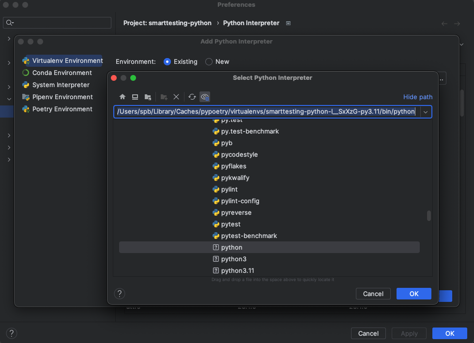
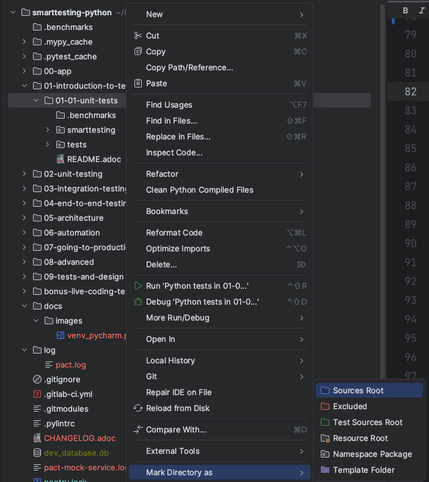

=  SmartTesting

== Struktura folderów

* Każda lekcja ma swoje podfoldery (e.g `01-introduction-to-testing`).
* Każdy folder zawiera plik `README.adoc` z dodatkowym opisem dla każdej lekcji.
* Moduł `00-app` zawiera aplikację symulującą kod biznesowy. Aplikacja będzie wykorzystana w pracy domowej.

== Wymagania

Żeby uruchomić projekt należy mieć zainstalowane:

* Python 3.11
* Poetry (https://python-poetry.org/docs/#installation)
* Docker
* Docker Compose

Upewnij się, że użytkownik systemowy z którego wykonujesz polecenia ma dostęp do polecenia `docker`.

Jeżeli używasz niestandardowej instalacji Dockera, może być potrzebne podanie w zmiennej środowiskowej lokalizacji gniazda do komunikacji z daemonem, np:
```bash
DOCKER_HOST=unix:///Users/spb/.colima/default/docker.sock pytest tests/
```

== Jak zbudować projekt?

Kod był rozwijany i testowany pod wersję Pythona 3.11. Zalecamy korzystanie z tej wersji. Gdyby nie został wybrany automatycznie, to uruchamiamy jeszcze przed wywołaniem `poetry install`:

```
poetry env use python3.11
```

Następnie, wystarczy uruchomić komendę w głównym katalogu:

```
poetry install
```

Poetry automatycznie utworzy nam virtualenv i zainstaluje zależności wymagane do wszystkich lekcji.

Aby móc wywoływać polecenia, musimy przełączyć się na powstały virtualenv:
```
poetry shell
```

== Uwagi dla Pythonistów

W części README w lekcjach znajdziecie dodatkowe wskazówki oznaczone emoji węża - 🐍.

Są to albo dodatkowe treści i biblioteki wykorzystywane w naszym języku albo rady specjalnie dla Pythonistów.

== Praca w konsoli

Przełączamy się na virtualenv:

```
poetry shell
```

Testy można uruchomić z katalogu głównego, podając pełną ścieżkę do danej lekcji:

```
pytest 01-introduction-to-testing/01-01-unit-tests/
```

Można też uruchamiać polecenie z środka danego folderu:

```
cd 01-introduction-to-testing/01-01-unit-tests/
pytest
```

*Uruchamiamy zawsze kod jednej lekcji naraz.*

== Praca w PyCharm

=== Interpreter projektu

Zaczynamy od ustawienia interpretera projektu. Najpierw w konsoli sprawdzamy ścieżkę:

```
poetry run which python
```

Następnie w konfiguracji (Project -> Python Interpreter) wskazujemy ścieżkę uzyskaną z polecenia `poetry run which python`, na przykład:



=== Ustawienie Sources root

Aby móc przeszukiwać kod danej lekcji, musimy ustawić jej folder jako sources root, np:



Tylko w ten sposób będziemy mogli nawigować w kodzie i wspomagać się wyszukiwaniem.

Większość tygodni będzie zawierać kilka lekcji - np. tydzień 3 ma m.in.:
```
03-integration-testing/
├── 03-02-xxx
├── 03-03-yyy
└── 03-07-zzz
```

W takim przypadku musimy pracować tylko jedną lekcja naraz i w danej chwili mieć albo `03-integration-testing/03-02-xxx` albo `03-integration-testing/03-03-yyy` albo `03-integration-testing/03-02-zzz` ustawione jako Sources Root.

Ustawienie kilku lekcji naraz jako Sources Root nie będzie dobrze działać. Po zakończeniu pracy z daną lekcją należy ją odznaczyć (Unmark as Sources Root w tym samym menu).

== Inne

Kod jest sformatowany blackiem na domyślnych ustawieniach - tj. maksymalna długość linii - 88 znaków.


**DISCLAIMER**

* Kod jest czysto demonstracyjny i nie stanowi wzorcowego kodu projektowego - zamiast na jak
najlepiej napisanym kodzie produkcyjnym koncentrujemy się na przykładach, które pozwalają pokazać
wiele sposobów pracy z testami; często celowo dodajemy "produkcyjny" kod, który nie jest poprawnie zaprojektowany po to, żeby pokazać jak sobie z nim radzić i mimo wszystko być w stanie go przetestować oraz przykłady złych testów, których radzimy unikać.
* Nie polecamy pisania komentarzy po polsku w projektach - tutaj robimy to, ponieważ jest to wyłącznie kod szkoleniowy.
